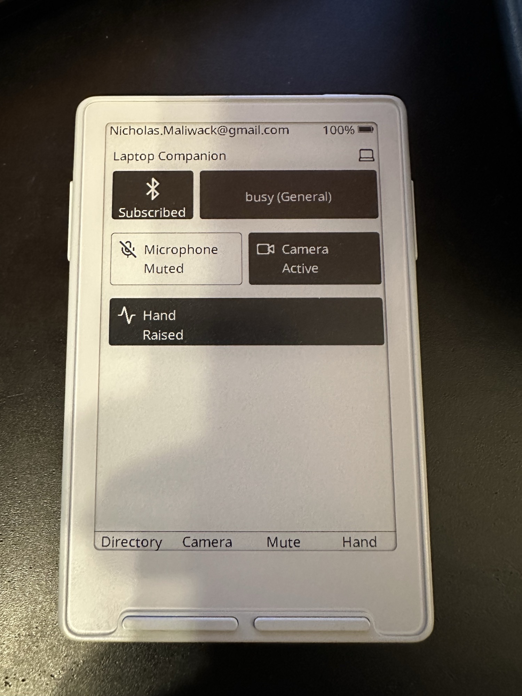

# X3 Bluetooth Laptop Companion

Firmware for an Xteink X3/X4 e-paper device built on the FreeInk SDK. The app
turns the device into a small Bluetooth laptop companion: part e-paper status
display, part macro pad for meeting controls. It pairs over Bluetooth LE with
the laptop host app and exposes quick controls for mute, camera, and raised-hand
state while keeping meeting status visible at a glance.



The project uses PlatformIO with Arduino for ESP32-C3. FreeInk is checked out as
a git submodule in `freeink`, and most hardware/display dependencies are linked
from that SDK through `platformio.ini`.

## What It Does

- Detects Xteink X3 vs X4 at boot and initializes the matching FreeInk display profile.
- Loads `/companion_settings.json` from the SD card to choose startup page,
  refresh behavior, debug options, button actions, and sleep image path.
- Renders pages through a dedicated FreeRTOS display task so input and BLE
  callbacks request work without drawing directly.
- Provides a Bluetooth laptop companion / macro-pad page using NimBLE and
  generated Lucide icons for connection, meeting, microphone, camera, and hand
  status.
- Sends meeting-control button events over BLE to the laptop host app for mute,
  camera, and hand toggles.
- Shows power and render diagnostics for light-sleep work.
- On power-button sleep, renders an SD BMP sleep image when available, including
  CrossPoint-style 2-bit/native grayscale and Atkinson dithering support, then
  powers down the display and enters ESP32-C3 deep sleep.

## Repository Layout

- `src/main.cpp`: boot, SD/settings load, device detection, display setup, input loop, deep sleep entry.
- `src/companion/`: BLE companion service and protocol handling.
- `src/page/`: page framework plus main, settings, companion, warning, and power stats pages.
- `src/icons/`: checked-in generated icon manifest/header used by the companion page.
- `laptop_host/`: Windows laptop companion host for receiving BLE events and
  controlling Microsoft Teams.
- `src/SleepImage.*`: SD BMP sleep image loader and grayscale display pipeline.
- `src/DisplayWorker.*`: display task and render request sequencing.
- `scripts/fix_freertos_linker.py`: PlatformIO pre-build patch for ESP32-C3 FreeRTOS flash section alignment.
- `freeink/`: FreeInk SDK submodule.

## Fresh Clone

After cloning, initialize the SDK submodule and nested submodules:

```powershell
git submodule update --init --recursive
```

Install PlatformIO if it is not already available:

```powershell
python -m pip install platformio
```

## Build

Always build with four jobs:

```powershell
pio run -e xteink -j4
```

Builds that rebuild Arduino/framework libraries can be slow. On a cold rebuild,
allow plenty of time; 30 to 60 minutes is possible on this environment.

The `xteink` environment enables both X3 and X4 build flags, Bluetooth/NimBLE,
power management, FreeRTOS tickless idle/runtime stats, and the custom ESP-IDF
SDK config entries in `platformio.ini`. The pre-build linker script patch keeps
`CONFIG_FREERTOS_PLACE_FUNCTIONS_INTO_FLASH=y` enabled while avoiding an ESP32-C3
firmware image alignment failure.

## Upload

```powershell
pio run -e xteink -t upload -j4
```

## Serial Monitor

```powershell
pio device monitor -b 115200
```

## SD Card Files

The firmware expects a settings file at:

```text
/companion_settings.json
```

The default sleep image path is:

```text
/sleep/sleep_screen.bmp
```

The sleep BMP should match the panel dimensions in either landscape panel
orientation or portrait orientation. Native 2-bit BMPs with palette levels
`0, 85, 170, 255` are preferred. High-color BMPs are converted at render time
using tuned 4-level quantization and Atkinson dithering.

## Icons

Companion icons are generated from the FreeInk Lucide icon set and checked in as
`src/icons/CompanionIcons.h`. The large downloaded converter payloads used while
generating icons are local tools and are intentionally ignored under `tools/`.

To regenerate icons, install or unpack an `rsvg-convert` executable locally and
put it on `PATH`, then run:

```powershell
python freeink\libs\assets\Icons\tools\gen_icons.py --manifest src\icons\companion-icons.txt --svgdir freeink\libs\assets\Icons\lucide\icons --sizes 28,36,48 --out src\icons\CompanionIcons.h
```

## Local-Only Files

`tools/` is ignored because it contains downloaded binaries and extracted package
payloads used for icon generation. `freeink-sd-shared-spi-fix/` is also ignored
as a local side checkout. Keep source changes in this repo, the `freeink`
submodule, or a reviewed patch/script rather than committing downloaded tools.
